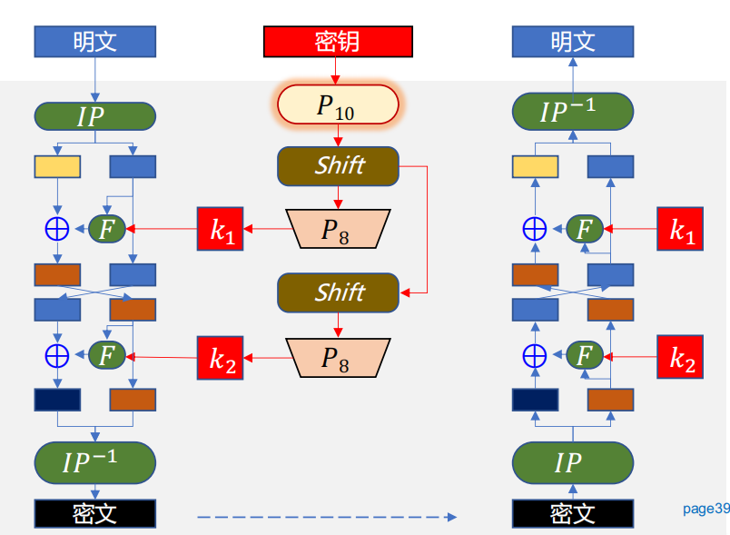
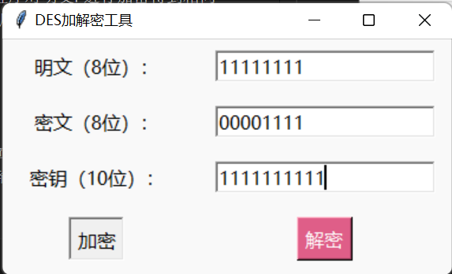

# 信息安全课程作业
这是一个简单的des加密的实现，包括加解密并实现简单的图形化
明密文均为8bit二进制数或1字节的字符，密钥为10bit的二进制数

小组名称：Sigma-men


## 内容介绍
### 背景介绍
DES加密是一种基于对称密钥密码体制的轻量级加密算法。它由IBM公司在1975年开发，被广泛应用于早期的计算机网络和数据安全领域。

Simple-DES是DES（数据加密标准）算法的简化版本，旨在提供一种快速且易于实现的加密解密方法。DES算法采用了64位密钥和64位明文块，并通过一系列的置换、替代和异或操作来进行加密处理。而Simple-DES则将密钥长度缩减为10位，并使用8位明文块。

### 算法介绍
如下图所示，s-des加密的主要步骤为：


接下来笔者进行简单的介绍。
#### 密钥处理
   
   
将10bit密钥进行P10置换:
1. 左移1位后进行P8置换，得到子密钥k1
2. 左移2位后进行P8置换，得到子密钥k2

#### 明文处理
1. 明文进行ip置换
2. 分割为左右两部分分别运算
3. 对右部分(4bit)进行扩展盒(EP-box)运算，扩展为8bit; 随后与k1进行异或运算
   
   

4. 将上一步异或的结果进行盒替换操作(左右两个s-box不同，左4bit进行s-box1置换，右4bit进行s-box2置换)，替换后得到4bit的结果


5. 将上一步的结果经过SP-box运算后得到右侧的输出F1

6. 左部分=将F1与左部分进行异或操作，右部分为原来的右部分
7. 交换左右部分，然后重复2-6操作，将子密钥替换为k2
8. 将左右两部分拼接回8bit，随后进行IP逆置换后得到密文

#### 密文处理
解密操作与加密操作相同，将明文替换为密文，交换k1、k2的顺序即可

### 代码使用的数据
P10置换与P8置换：


IP置换及逆置换：


扩展盒：


s置换盒


SP盒


## 运行环境
python3.11.5

numpy 1.26.0 

tk 8.6.12
## 关卡测试
### 第1关：基本测试
要求：根据S-DES算法编写和调试程序，提供GUI解密支持用户交互。输入可以是8bit的数据和10bit的密钥，输出是8bit的密文

设计的ui界面如下图所示


有三个输入框，分别可供输入明文、密文、密钥

输入明文+密钥，点击加密则可在对应的密文框中得到密文：





同样的输入密文+密钥，点击解密即可在对应的明文框得到明文


### 第2关：交叉测试
要求：考虑到是算法标准，所有人在编写程序的时候需要使用相同算法流程和转换单元(P-Box、S-Box等)，以保证算法和程序在异构的系统或平台上都可以正常运行。设有A和B两组位同学(选择相同的密钥K)；则A、B组同学编写的程序对明文P进行加密得到相同的密文C；或者B组同学接收到A组程序加密的密文C，使用B组程序进行解密可得到与A相同的P。

从陈鹏帆同学的小组获取密文00000100、密钥1111111111，然后由我们小组进行解密，获取到的明文与该小组加密之前的明文相同。再经过多次尝试，也能验证证明加解密规则一致。


### 第3关：扩展功能
要求：考虑到向实用性扩展，加密算法的数据输入可以是ASII编码字符串(分组为1 Byte)，对应地输出也可以是ACII字符串(很可能是乱码)


经过一些改进，可以将输入的字符进行转化为对应的ASCII码，然后，再转为二进制，最后带入加解密运算，同样地，也能把加解密后的结果以字符的形式输出


基于相同的原理，也可以对密钥做相同的处理，即用字符作为密钥来进行加密


为了程序的鲁棒性，对用户的输入判别需要做出规范，当输入的并非8/10bit二进制亦或是1byte字符时，需要提示用户进行正确的输入，如下图所示


### 第4关：暴力破解
要求：假设你找到了使用相同密钥的明、密文对(一个或多个)，请尝试使用暴力破解的方法找到正确的密钥Key。在编写程序时，你也可以考虑使用多线程的方式提升破解的效率。请设定时间戳，用视频或动图展示你在多长时间内完成了暴力破解。

由于这是个十分简单的DES加密，密钥只有10位，总共1024种可能性，因此如果知道多对明密文后，想要进行破解得到密钥并不困难
通过对已知的几组明密文对进行不断尝试使用密钥进行加密，然后与正确密文进行比对，当所有明文都能够被正确加密时，那么此时获取到的密钥就是可能的密钥之一

一个简单的代码示例如下：
```python
#暴力破解
key = [0,1,0,1,1,0,1,0,1,0]
plaintext1=[1,1,1,1,1,1,1,1]
plaintext2=[1,1,1,1,1,1,1,0]
plaintext3=[1,1,1,1,1,1,0,1]
plaintext4=[1,1,1,1,1,1,0,0]

ciphertext1=[0,0,0,0,1,1,1,1]
ciphertext2=[0,1,1,1,0,1,1,0]
ciphertext3=[0,1,0,1,1,0,1,0]
ciphertext4=[0,1,1,1,1,1,0,1]
for i in range(1024):

    binary = bin(i)[2:].zfill(10)  # 将迭代变量转换为二进制字符串，并填充到10位
    new_key = key.copy()
    for j in range(10):
        new_key[j] = int(binary[j])  # 更新密钥的每一位
    ciphertext11=DES_en_de_crypt.encrypt(plaintext1,new_key)
    ciphertext12=DES_en_de_crypt.encrypt(plaintext2,new_key)
    ciphertext13=DES_en_de_crypt.encrypt(plaintext3,new_key)
    ciphertext14=DES_en_de_crypt.encrypt(plaintext4,new_key)

    if (ciphertext11 == ciphertext1).all() and (ciphertext12==ciphertext2).all() and (ciphertext13==ciphertext3).all() and (ciphertext14==ciphertext4).all():

       print(new_key)
       print(i)
```

下面为打印结果：


根据结果，分别在第767次尝试和第1023次尝试时获取到了密钥，并且两个密钥并不相同

### 第5关：封闭测试
要求：根据第4关的结果，进一步分析，对于你随机选择的一个明密文对，是不是有不止一个密钥Key？进一步扩展，对应明文空间任意给定的明文分组Pn，是否会出现选择不同的密钥Ki！=Kj加密得到相同密文Cn的情况？

#### 1.同组明密文是否存在多个密钥

根据第4关的结果我们知道，显然，对于一组明密文，存在不同的密钥，并且我们尝试输入明密文、密钥进行加解密，来验证这两个密钥是否都有效

   
   

根据验证结果，确实存在多个密钥使得加密结果相同

#### 2.不同明文+不同密钥 加密后得到相同密文

与第4关的解决思路相同，可以尝试用相同的密文+不同的密钥进行解密，看是否能够得到相同的解密明文

如下图，对密文11111111进行解密，可以通过不同的密钥得到不同的明文，反之说明，可以用不同的明文和不同的密钥得到相同的密文


再尝试其他组合：也能够实现此功能


总而言之，在这个简单的对称加密中，不同明文+不同密钥，加密后能够得到相同密文

感谢老师的指导与组员的辛勤工作！

指导老师：陈欣